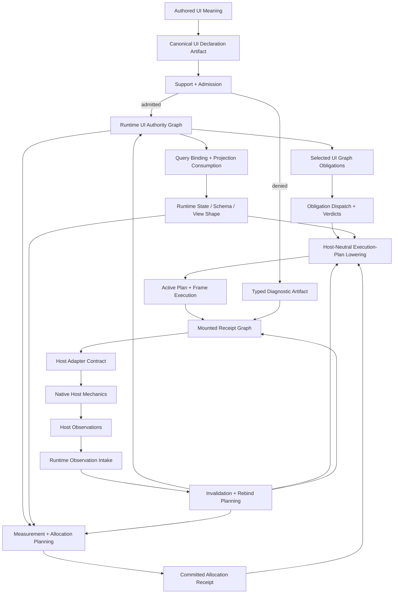
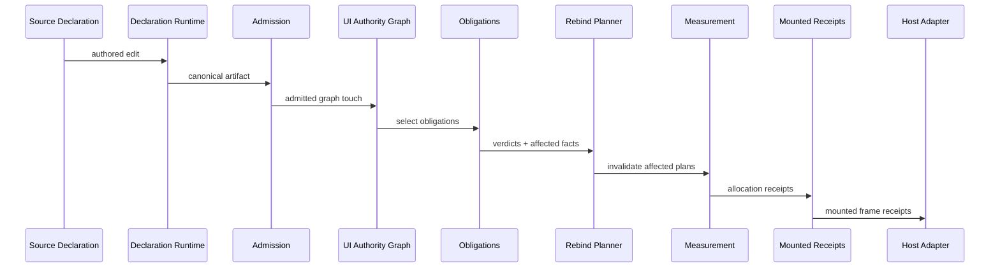
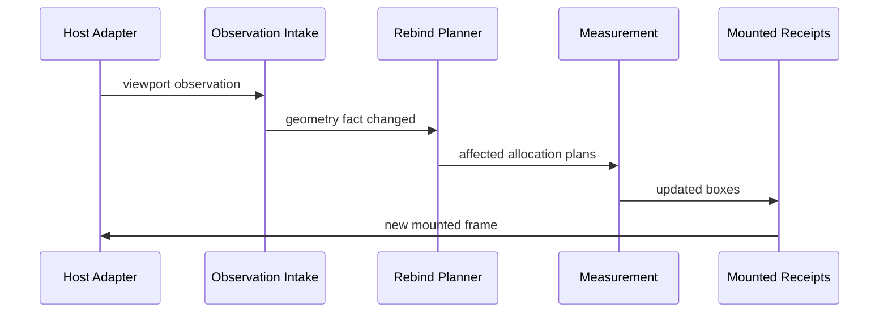
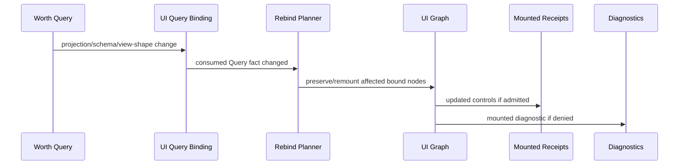
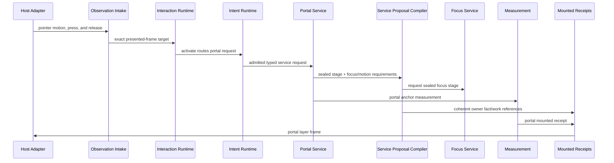
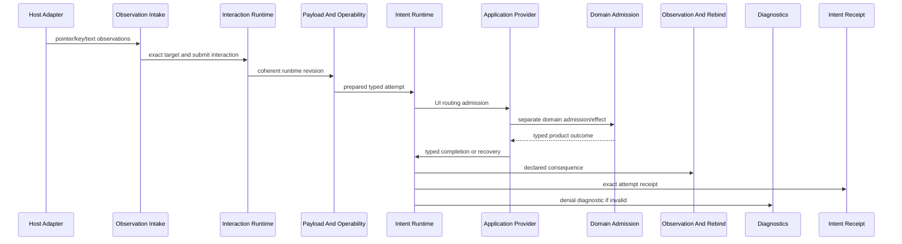

# Worth UI Runtime Orientation For AI Agents

This document is the orientation map for AI agents building `worth-ui`, the
runtime-owned UI composition layer for Worth applications.

It is not an API reference, milestone spec, component catalog, or tutorial.

Its job is to answer:

1. What category of UI runtime work am I touching?
2. Who owns the meaning?
3. What artifact must be produced, preserved, inspected, or denied?
4. Which boundary must not be bypassed?
5. What local shortcut would turn into folklore?

Assume the agent is capable. Do not overfit to examples. Use this file as the
authority map before editing code.

## Truthfulness Rule

This file is the architectural contract, not an automatic support claim.

If a family appears here, that means:

- this is the right boundary for that family
- new work should land here instead of inventing a local substitute
- support posture still must be proven through admitted rows, receipts, tests,
  and milestone closure

Do not read a category name in this file and assume the implementation already
supports it fully.

The honest rule is:

```text
named here = belongs here
admitted elsewhere = supported here
```

---

## Runtime Stack

Worth UI sits in this stack:

```text
domain application / product shell
-> worth-ui facade
-> worth-ui-runtime
-> worth-ui-query-binding
-> worth-ui-host-contract
-> worth-ui-host-* adapters
-> native host mechanics

application Query entry
-> worth-query-decl / worth-query-host
-> installed Query audience products
-> worth-ui-query-binding

current temporary internal edge:
worth-ui-query-binding -> worth-query

worth-query -> worth-runtime-bridge
-> worth-relational + worth-signal
```

Layering matters.

Worth UI is not a widget helper over a native adapter. It is the product-facing UI runtime
layer. It owns declaration entry, support/admission, UI graph authority, graph
touch obligations, measurement/allocation, mounted receipts, service topology,
hot rebind, diagnostics, and host boundary contracts.

The host adapter owns native mechanics only.

Worth Query is the application-facing composition authority. It owns query
declarations, application-operation admission, touched graph authority, access
planning, projection consumption, live/query state, support posture, basis,
async/resource posture, and routing into the domain and lower runtimes that own
their respective truth.

Ordinary UI work starts at Worth UI. Ordinary domain/read/write work starts at
Query. Use lower layers to understand semantics, not as permission to bypass
the owning runtime.

---

## Core Rule

The governing Worth UI rule is:

```text
declare UI meaning once
admit and lower it once
bind it into a runtime-owned UI graph
project it into mounted receipts
let hosts consume receipts and report observations
never let host code recreate UI meaning
```

That rule explains most of the architecture.

## Current Ordinary Application Path

The implemented application boundary is:

```text
WorthUi::app()
-> registration plus optional sealed candidate composition
-> WorthUiApplicationBuilder::freeze()
-> WorthUiApp
-> WorthUiApp::launch()
-> WorthUiActiveApplicationSession
-> WorthUiActiveApplicationSession::execute_mounted_frame(...)
```

`freeze` is the only ordinary preparation lane and returns a typed denial. Its
success binds the runtime artifact, declarations, graph, capabilities, Query
binding plan, host-session plan, and inspection indexes into one prepared
application generation.

`launch` consumes that prepared authority. The resulting active application
session owns framework turns, host observation capability, active inspection,
retained allocation evidence, Query projection submission, and atomic
replacement. Framework completions and active inspection receipts carry the
same application-generation identity. Graph-bound allocation receipts carry
the graph generation that admitted their neighborhood.

File composition enters through `facade::source` as one
`WorthUiWatchedCandidateSubmission`. Typed Rust composition enters through
`WorthUiApplicationBuilder::with_rust_authored_input(...)`. Both are compiled
by `worth-ui-dsl` into the same sealed semantic package before runtime
preparation. Neither lane permits callers to extract an independently
launchable artifact or declaration source.

Replacement remains session-owned:

```text
prepare replacement
-> prepared candidate authority
-> candidate graph/allocation admission
-> lower and stage
-> framework-turn activation boundary
-> atomic cutover
```

Preparation is not a semantic no-op decision. The current lifecycle carries a
successful preparation through complete-plan lowering and exact executable
comparison. Only the activation decision can return a typed semantic no-op, and
artifact digest equality cannot skip that work.

Invalid or foreign input leaves the active generation intact. Host adapters
cannot submit directly; observation capability comes from the active session.
See [Application lifecycle](./application-lifecycle.md) for the public workflow,
cost receipts, and typed outcomes. See `../AI_README.md` for the compact
discovery guide and named facade entry points.

## Runtime Ownership Map

The mechanically enforced seven-owner map, allowed dependency direction, and
future insertion points are maintained in
[Runtime subsystems](./runtime-subsystems.md). This orientation explains the
broader platform vocabulary; the subsystem map is the placement authority for
new runtime work.

Worth UI wants product code to express UI meaning once, keep that meaning
canonically identified, and let the runtime lower it through typed public lanes
instead of forcing every page, control, renderer, host adapter, or test to
invent local wrappers, local status enums, local layout rules, local portal
systems, local interaction callbacks, or local diagnostics.

If a downstream crate is about to invent a pseudo-Worth-UI layer, stop and
identify the missing runtime category.

## Adversarial Constraint

A running Worth UI app must survive source edits, Query-backed state changes,
viewport/measurement changes, host-observation changes, and operating-world
changes without:

- recreating UI meaning in host code
- broad rescans when the affected subgraph is already known
- tree-position identity guesses
- local layout or portal folklore
- local query/result-state clones
- invalid reloads corrupting the last admitted mounted truth

The system must preserve stable identity where admitted, deny unsupported or
illegal transitions with typed evidence, and prove rebind breadth through
declared consumed facts plus graph indexes rather than post hoc scans.

---

## Architectural Shape

The core flow is:

```text
authored UI declaration
-> canonical declaration artifact
-> support/admission
-> runtime UI authority graph
-> selected graph obligations
-> query binding/projection consumption
-> measurement/allocation plan
-> committed allocation receipt
-> host-neutral execution-plan lowering
-> active-plan frame execution
-> mounted receipt graph
-> host adapter contract
-> host observations
-> invalidation/rebind
-> updated mounted receipts or diagnostics
```

Hot reload is not a feature layer. It is the behavior of this pipeline under
declaration, state, capability, measurement, and host-observation change.

---

## Canonical Flow



Interpretation:

- Authored UI meaning is input, not authority after lowering.
- The UI graph is runtime truth for mounted structure.
- Query binding consumes Query artifacts; it does not reopen Query authority.
- Measurement is runtime-owned even when host measurements are required.
- Execution-plan lowering resolves frame strategy once from sealed upstream
  authority; the active session is the only ordinary plan executor.
- Mounted receipts are the only host-consumable output.
- Host events are observations, not semantic decisions.
- Rebind is planned from consumed facts and aspect truth, not guessed from tree
  position.

---

## Authority Map

| Concern | Owner |
| --- | --- |
| Authored UI meaning | UI declaration family |
| Canonical UI identity | UI declaration artifact |
| Semantic aspect contract | UI declaration family + admitted aspect rows |
| Runtime structure | UI authority graph |
| Parent/child/slot ownership | UI authority graph |
| Presence/visibility/participation | UI authority graph + participation semantics |
| Structural legality | UI graph obligations |
| Support posture | Admission/support matrix |
| Query-backed state | Worth Query via UI query binding |
| Projected UI facts | Query projection consumption receipts |
| Layout meaning | Measurement/allocation runtime |
| Intrinsic measurement request | Measurement runtime |
| Native measurement result | Host observation returned through host contract |
| Executable plan meaning | Execution-plan lowering over sealed upstream authority |
| Active plan and frame execution | Active application session |
| Reload/lowering and steady-frame cost evidence | Runtime counter boundaries |
| Mounted screen output | Mounted receipt graph |
| Native paint/input mechanics | Host adapter |
| Pointer/key/focus/viewport input | Host observations |
| Click/submit/edit meaning | Intent/operability runtime |
| Portal topology | Runtime portal service |
| Focus routing | Runtime focus service |
| Motion/animation meaning | Runtime motion service |
| Typed shortcut matching and command winner | Runtime command-routing service |
| Semantic offset, nested routing, bounds, and anchoring | Runtime scroll service |
| Stable-key set and range posture | Runtime selection service |
| Aspect publication and subscription | UI graph + aspect indexes |
| Hot reload | Invalidation + rebind planning |
| Failure explanation | Typed diagnostics/evidence |
| Certification | Runtime/consumer proof harness |

No other location may become an authority for these concerns.

---

## Artifact Families

Worth UI is artifact-driven. Prefer retained, typed artifacts over local state,
display strings, closures, booleans, and renderer-local objects.

Required artifact families:

```text
UiDeclarationArtifact
UiDeclarationIdentity
UiDeclarationFamily
UiAspectContract
UiAdmissionReport
UiSupportSnapshot
UiGraphNodeIdentity
UiGraphSnapshot
UiGraphTouchDescriptor
UiSelectedObligationSet
UiObligationDispatchPlan
UiObligationVerdict
UiMeasurementRequest
UiMeasurementResult
UiAllocationPlan
UiAllocationReceipt
UiExecutionPlanLoweringAuthority
UiCandidateExecutionPlan
UiActiveExecutionPlan
UiPlanEquivalenceDecision
UiFrameExecutionReceipt
UiProjectionBinding
UiSettledQueryFactReceipt
UiIntentDeclaration
UiIntentAdmission
UiMountedNodeReceipt
UiMountedFrameReceipt
UiHostObservation
UiRebindPlan
UiRebindReceipt
UiAspectCoverageReport
UiAspectFitReport
UiDiagnosticArtifact
UiCausalInspectionReport
```

Names can evolve. The categories may not collapse.

---

## Operating Worlds

Worth UI must preserve operating-world posture instead of flattening it into
one UI state.

Minimum worlds:

```text
authoritative
preview
branch
hot-reload-candidate
diagnostic
host-observation
test-certification
```

Worlds affect admission, operability, preservation, diagnostics, and Query
binding.

Do not treat preview UI, branch UI, diagnostic UI, and authoritative UI as the
same mounted state with different booleans. The same declaration may be
admitted differently by world.

Support posture should be world-aware. A family can belong in the architecture
while still being denied, deferred, host-gated, or preview-only in a given
world.

---

## Declaration Authority

Use this category when defining UI meaning.

Declarations answer:

```text
what UI meaning is requested?
what family owns it?
what canonical identity does it carry?
what graph touch can it imply?
what Query projections may it consume?
what host capabilities may it require?
what service families may it touch?
what outcomes must be retained?
```

Every declaration family must also define:

```text
its schema-owned authoring shape
its canonical identity lane
its declared aspect contract
its support/admission row
its graph-touch descriptor family
its retained receipt families
its diagnostic/evidence contract
its required index contributions and index lookups
```

When a declaration can produce repeated or conditional instances, it must also
define the stable logical identity lane for those instances. Do not let current
order, current visibility, or current slot position become identity truth.

Declaration families should include, at minimum:

```text
page
page-set
region
mosaic
local-composition
control
control-projection
intent
query-binding
portal-request
focus-scope
motion-request
diagnostic-surface
accessibility-participation
```

A button is not an architecture boundary. A button is a control declaration
with participation, measurement, mounted receipt, visual projection, and intent
semantics.

A dropdown is not an architecture boundary. A dropdown is a control projection
plus portal request plus focus/dismissal obligations plus Query or local option
projection.

A page is not a renderer switch. A page is a declared graph topology region
with route/page-set semantics and mounted participation posture.

A mosaic is not a convenience container. It is a declared structural host for
page/region topology. Local composition is the inner content arrangement lane.
Do not make mosaics impersonate local flow layout, and do not make local flow
layout impersonate shell topology.

Mistakes to avoid:

- host-local component construction
- declaration identity derived from display text
- tree-position identity
- closures as semantic intent
- renderer-local visibility
- local DTOs that duplicate declaration artifacts
- one component type owning declaration, state, layout, portal, and host
  translation at once

---

## Canonical Declaration Artifact

After declaration authoring, Worth UI lowers into one canonical declaration
artifact.

That artifact is the only admitted source of runtime UI meaning. It must carry:

```text
declaration identity
declaration family
declared aspect contract
declared topology
declared touch meaning
declared service usage
declared Query bindings
declared measurement/allocation policy
declared participation posture
declared host capability requirements
diagnostic provenance
```

Do not let runtime planning rediscover these from source text, host code, or
renderer branches.

The declaration artifact must be durable enough to drive hot reload, branch
preview, denial presentation, and bounded rebind without rereading authored
files to rediscover meaning.

---

## Admission And Support Authority

Use this category when deciding whether a declaration, service, binding, host
capability, or operating world is real now.

Admission answers:

```text
is this family supported in this runtime profile?
is this declaration legal in this world?
does the host support the required capability?
does Query support the required projection/view/state posture?
does this graph touch have required obligation support?
does measurement require an unsupported mode?
must this fail closed, degrade, or emit diagnostic-only posture?
```

Support is not autocomplete. Visible vocabulary is not admitted support.

Every admission denial must produce typed posture, not a string-only error.
Distinguish at least:

```text
unsupported
denied
deferred
diagnostic-only
wrong-world
wrong-host-capability
wrong-query-basis
schema-mismatch
rebind-required
stale
ambiguous
budget-exceeded
```

Mistakes to avoid:

- assuming a public type is supported because it compiles
- local support flags
- matching error text
- flattening stop states into `bool`
- bypassing admission because a demo needs the feature
- teaching host adapters to degrade behavior silently

---

## Aspects Are Semantic Contracts

Worth UI should adopt Query's aspect lesson directly:

```text
aspects are contracts, not decoration
```

In Worth UI, aspects are the auditable names for semantic UI dependencies,
semantic UI outputs, and semantic UI invalidation scope.

They answer:

```text
what exact slice of UI meaning is being declared?
what exact slice of UI meaning does a receipt consume?
what exact slice of UI meaning changed?
what exact slice of UI meaning can invalidate a graph neighborhood?
what exact slice of UI meaning is admitted, denied, preserved, or unsupported?
```

The important distinction is:

- declaration families say what category of UI thing exists
- aspects say which semantic slice of that thing is in play

A control declaration without an explicit aspect contract is too broad. A graph
touch without aspect posture is too broad. A receipt that only says "the button
changed" is too broad.

At minimum, every serious UI family should be able to speak in stable aspect
families such as:

```text
structure.parentage
structure.slot-membership
structure.page-membership
presence.mounted
presence.visible
participation.layout
participation.hit-test
participation.focus
participation.accessibility
layout.kind
layout.constraints
layout.intrinsic-measurement
layout.allocation
appearance.background
appearance.foreground
appearance.border
appearance.radius
appearance.opacity
content.text
content.icon
content.projected-value
content.projected-collection
interaction.kind
interaction.operability
interaction.payload-shape
interaction.cursor
service.portal
service.scroll
service.focus-routing
service.motion
diagnostic.presentation
```

These names are examples of architecture-level aspect families, not permission
to make ad hoc component-local aspect folklore. The point is stable semantic
granularity across pages, mosaics, controls, portals, diagnostics, and future
runtime services.

Every declaration family must define:

```text
which aspects it may publish
which aspects it may consume
which aspects are required for admission
which aspects can change without changing identity
which aspects are world-sensitive or host-capability-sensitive
which aspects are preserved in receipts and diagnostics
```

If a design treats aspects as incidental strings, broad "changed" flags, or
component-local styling trivia, the architecture has already degraded.

---

## Runtime UI Authority Graph

Use this category when deciding what exists, where it lives, and what
participates.

The UI graph owns mounted runtime structure:

```text
node identity
owner identity
parent/child relation
slot relation
page membership
region membership
mosaic topology
portal logical owner
portal mounted host
focus scope membership
layout participation
hit-test participation
accessibility participation
visibility/presence posture
scroll ownership
query binding attachment
service attachment
diagnostic attachment
stable repeated-instance identity
declaration-instance correspondence
published aspect membership
aspect-scoped dependency attachment
```

The graph is not a convenience tree. It is the canonical runtime topology.

The graph must support stable lookup by canonical identity. Do not start with
recursive tree walks, per-call scans, or local registries and call the index a
later optimization. The graph/index is part of the proof boundary.

Participation must be explicit. Do not inherit the web's accidental split
between existence, display, visibility, hit-testing, focus, accessibility,
layout, and event participation. Model participation as typed runtime posture.

Minimum participation axes:

```text
exists
mounted
visible
layout-participating
hit-test-participating
focus-participating
accessibility-participating
paint-participating
input-participating
query-bound
service-bound
diagnostic-presenting
```

Mistakes to avoid:

- renderer-owned page switching
- host-owned portal topology
- local z-order stacks
- conditional rendering outside graph admission
- visibility as a paint-only property
- graph mutation without touch descriptors
- identity inferred from sibling index

---

## Graph Touch Obligations

Use this category when a graph touch implies semantic work the caller should
not remember manually.

Ordinary path:

```text
touch descriptor
+ operating world
+ support posture
+ obligation index
-> selected obligations
-> dispatch plan
-> verdicts
-> receipts/evidence/diagnostics
```

Graph touch descriptors should declare:

```text
what node or edge family is touched
what authority world the touch occurs in
what structural meaning may change
what aspects are read, written, invalidated, or preserved
what services are implicated
what Query bindings may be affected
what measurement/allocation surfaces may be affected
what participation posture may be affected
```

Touch origin must also be explicit. At minimum, distinguish:

```text
declaration change touch
Query-backed fact change touch
host observation touch
service-event touch
intent submission touch
diagnostic-only touch
```

Those are not implementation details. They determine which obligation families
are even eligible to run.

Aspect posture must participate in obligation selection. An appearance-only
touch must not silently trigger structure or focus obligations just because it
hit the same node family.

Obligation families should include:

```text
structural-legality
participation-legality
slot-contract
measurement-requirement
query-binding-requirement
intent-operability-requirement
portal-host-requirement
focus-route-requirement
motion-support-requirement
accessibility-requirement
host-capability-requirement
diagnostic-surface-requirement
```

A graph operation should not remember validators. It should declare touched
meaning. The runtime selects the obligations.

Mistakes to avoid:

- manual invariant packs as the ordinary path
- local legality graphs
- renderer pre-validation
- local validator tables
- graph walks hidden inside commands
- broad validation after mutation instead of selected obligations before
  admission

---

## Indexing Is Part Of Correctness

The graph must support stable lookup and bounded rebind from the beginning.
Indexing is not an optimization pass. It is part of the proof boundary.

At minimum, Worth UI needs explicit indexes for:

```text
graph node identity -> node
declaration identity -> graph node(s)
parent identity -> child set
slot identity -> occupant set
page identity -> participating node set
portal owner -> portal attachment set
focus scope -> participant set
query binding identity -> bound node set
runtime service attachment -> attached node set
consumed fact identity -> dependent graph node / receipt set
published aspect identity -> publishing node / receipt set
consumed aspect identity -> dependent node / obligation / receipt set
repeated owner + logical member identity -> runtime instance node
mounted receipt identity -> mounted receipt
host observation target -> affected graph node / receipt set
```

Index publication must happen as part of graph admission and graph mutation.
Indexes are not optional adapter caches or later accelerators.

Each declaration and receipt family must be explicit about:

```text
which indexes it publishes into
which indexes it is allowed to query through
which identities are stable keys
which reverse dependencies must be retained for bounded rebind
which aspect slices are indexed as publication versus consumption
```

Index updates must be transactionally aligned with graph truth updates. Do not
allow a graph mutation to succeed while its index neighborhoods are stale.

Why this matters:

- stable identity lookups must not require recursive walks
- rebind breadth must be derived from consumed facts, not guessed
- aspect-local changes must invalidate aspect-local dependents, not sibling
  semantics by accident
- page/mosaic/portal changes must localize to indexed topology
- host observations must invalidate only affected subgraphs
- touched graph obligations must dispatch from explicit neighborhood lookup

If a design starts with recursive tree walks, broad page rescans, or
renderer-side membership maps, it has already violated the architecture.

The Query analogy is direct:

- declarations say what a UI operation means
- touch descriptors say what graph meaning it affects
- indexes make the affected neighborhood mechanically reachable
- rebind uses those indexes to prove bounded breadth

---

## Query Binding And Projection Consumption

Use this category when UI state depends on domain/runtime truth.

Worth UI must not become a local Query clone. It consumes Query-owned artifacts
through admitted binding/projection lanes. The destination audience boundary
is `worth-query-decl` for declared application requirements and
`worth-query-host` for hosted progression. `worth-query-replay` is
certification-only and is not an ordinary UI binding dependency.

The ordinary application path is:

```text
install the authored WorthUiStatusSourceOwner (or another binding-owned source)
-> express the requirement through the Query declaration audience
-> install and progress its request through the Query host audience
-> obtain its shape-specific registration and initial advance
-> register_scalar_projection(...) or register_collection_projection(...) on WorthUi::app()
-> freeze and launch one active application session
-> admit the Query-issued observation through begin_projection_rebind(...)
-> mount semantic content and publish through the ordinary host contract
-> release the affine fact to the Query lifecycle owner
```

The public application grammar enters through
`worth_ui::facade::query_binding`; there is no
`WorthUiQueryWorkspaceExt` product import. The installation owner obtains an
`UiInstalledProjectionView`, then declares a scalar or keyed collection
registration with selected fields, native family, lifecycle, and collection
cardinality posture. Application code cannot assemble a binding or fact from
result shape, basis, capability status, or reporting identities.

Projection crosses the UI boundary as a shape-specific observation and affine
fact receipt. `UiProjectionAvailability` distinguishes unavailable, present,
and stopped; `UiPresentProjection` distinguishes current from retained stale
activity. Exact stop kinds preserve schema, payload, native-family, world,
generation, basis, support, remasking, budget, and reset distinctions.
Foundational native values remain native through consumption and mounted
semantic text; they do not take a JSON, debug-string, or widened-number detour.

See [Query-backed UI views](./query-binding.md) for the public entry points and
worked examples.

UI query binding answers:

```text
which Query artifact is consumed?
which basis/world is it bound to?
which shape-specific projection fact is consumed?
which schema/view shape is expected?
which scalar field or keyed collection fields are projected?
which availability, currency/activity, and stop posture is retained?
which compatibility proof admits replacement?
which completeness and continuation posture governs a collection?
which invalidation aspects affect the UI graph?
which access, row, byte, and retained-resource budget applies?
```

If a UI binding consumes Query truth without retaining the aspect contract that
made the binding honest, the UI runtime has already lost its proof boundary.

The UI may project product-facing state from Query results, but Query remains
the authority for query meaning, basis, projection facts, async posture, live
state, and application-operation admission.

Query also remains the owner of installed-domain and live-resource activation,
maintenance, recovery, and disposal. Worth UI binds admitted references to its
application/plan generation, coordinates exact-once succession at cutover, and
returns the published affine fact to its owner; it does not become a
subscription manager, session data cache, or local Query runtime.

View shape is not UI-only sugar. It can affect planning, invalidation, live
patch shape, delivery formatting, and binding support.

Current implementation note: `worth-ui-query-binding` still carries a
temporarily admitted raw `worth-query` dependency. That edge is predecessor
debt, not a public application contract. New UI work must not widen it. The
binding owner must remove the remaining raw-engine imports so
`worth-query-decl` and `worth-query-host` are its only ordinary Query audiences
before broader Query-facing surface work lands.

Minimum binding postures:

```text
pending
current
stale
revalidating
failed
retried
superseded
cancelled
denied
unsupported
remasked
schema-mismatch
payload-shape-mismatch
native-family-mismatch
wrong-world
stale-generation
basis-mismatch
budget-exceeded
reset-required
```

Mistakes to avoid:

- local `loading/error/retry` enums replacing Query result-state
- renderer-side query builders
- a product workspace-extension import that bypasses hosted installation
- field visibility computed from local caches
- operational literal-field lookup after contract admission
- payload shape assembled in renderer code
- schema swaps handled by component conditionals
- UI reading relational/bridge internals directly
- reopening materialized facts instead of consuming projection receipts
- splitting a consumed projection into UI-local basis/status/fact/digest truth
- stringifying or JSON-encoding native aspect values for operational UI use
- implementing live-view activation, recovery, or disposal in the UI runtime
- treating reporting identities or inspection projections as reassembly parts
- crossing scalar and collection facts or treating continuation as scalar state

Rich tables, joins, expressions, formatting/coercion, mutation intents, and
general authored composition are additive successors. They must consume these
same installed bindings, typed postures, and ordinary rebind/publication path;
they do not justify a second Query or renderer-owned lane.

---

## Measurement And Allocation Authority

Use this category when space, sizing, intrinsic measurement, scrolling, or
resize behavior is involved.

This is one of the highest-risk boundaries.

The runtime owns layout meaning. The host may provide measurements and perform
paint mechanics, but the host must not decide layout semantics.

Canonical path:

```text
viewport/host observation
+ graph participation
+ sizing declarations
+ constraints
+ intrinsic measurement requests/results
+ Query-projected content shape
-> allocation plan
-> allocation receipt
-> mounted node boxes
```

Minimum sizing vocabulary:

```text
fixed
hug
fill
equal-share
min
max
bounded
content-measured
viewport-relative
scroll-owned
portal-anchored
```

Minimum measurement concepts:

```text
available-space
intrinsic-size-request
text-measure-request
host-measure-result
allocation-plan
allocation-receipt
overflow-posture
scroll-region
clipping-region
```

Intrinsic measurement is host-supplied evidence, not host-owned layout truth.
The runtime requests measurement, receives evidence, and then decides layout
meaning through admitted allocation policy.

Resize is not host mutation. Resize is host observation -> runtime invalidation
-> allocation replan -> mounted receipts.

Scrollbars, text wrapping, DPI/font scale, viewport changes, portal size
negotiation, and content growth must enter as measurement/observation facts.
They must not become host-local patch rules.

Mistakes to avoid:

- a host adapter deciding layout meaning
- implicit shrink/grow behavior
- layout behavior hidden in control rendering
- scroll ownership inferred from overflow accidents
- whole-tree relayout when affected subgraph is known
- text measurement cached as authoritative truth
- portal layout performed outside runtime allocation

---

## Execution-Plan Lowering And Frame Authority

Use this category when canonical UI meaning becomes frame-executable work.
Milestone 3.9 closes this boundary; until that cutover is complete, provisional
plan APIs are implementation substrate rather than an application contract.

The target path is:

```text
prepared candidate application authority
+ exact graph, capability, Query, and host-support authority
+ committed allocation receipt
-> sealed execution-plan lowering authority
-> host-neutral candidate plan bundle
   { topology, compact typed handles, lane-ready plans, equivalence evidence }
-> semantic no-op, bounded replacement, initial activation, or typed denial
-> atomic application + active-plan publication
-> active-session frame execution
-> lane and frame-cost receipts
```

The plan caches decisions that would otherwise be rediscovered every frame. It
does not replace declaration, graph, Query, allocation, host-support, or durable
state authority. A digest can index or describe a plan but cannot prove
identity, freshness, equivalence, or permission to execute it.

The ordinary caller does not construct a plan, choose a lane, allocate runtime
handles, compare plan digests, or pass a plan into an executor. The active
application session owns the executable generation. Handles are compact sealed
locators into that exact generation and family; a stale or foreign handle opens
no door even when its numeric fields match.

Plan equivalence is exact executable meaning, not visual similarity. A change
to capability/host support, Query binding, lane policy, extension hook,
resource, durable-state contract, or another execution-bearing field must not
be hidden by equal output or equal hashes. Diagnostic formatting and incidental
candidate generations do not cause operational churn when executable meaning
is unchanged.

Ordinary frame work is bounded by intentionally touched plan rows. Source
parsing, artifact validation, registry string lookup, broad graph/plan scans,
rich diagnostic materialization, and general-purpose heap allocation do not
belong on that path. Reload/lowering counters and steady-frame counters are
different evidence families because reconstructive and ordinary cost are
different claims.

Inspection may explain the lowering basis, active generation, lane partition,
equivalence/no-op decision, affected closure, handle family, and frame cost. It
may not mint handles, promote a candidate, submit a plan, or turn a receipt or
digest into authority.

---

## Mounted Receipts

Use this category when producing host-consumable output.

Mounted receipts are the only output the host adapter may render.

A mounted receipt may include:

```text
mounted node identity
graph node identity
allocation box
clip
layer
paint intent
visual state projection
input participation
focus participation
hit-test participation
accessibility facts
scroll region
portal layer attachment
motion projection
diagnostic projection
host capability requirements
```

Mounted receipts are not widgets. They are runtime-owned facts the host
consumes.

All ordinary, preview, and replacement contributions enter one
`UiPreparedMountedFrame`. The public visible-frame path is
`WorthUiActiveApplicationSession::execute_mounted_frame`; a lane receipt,
preview projection, or graph-node receipt is never independently presentable.
The frame becomes current only after every required surface completes and the
runtime publishes the prepared tuple.

Keep these identities separate:

```text
semantic surface
host surface binding generation
mounted instance and mount incarnation
frame-scoped node receipt
mounted frame
presentation attempt
publication receipt
```

The host adapter should be replaceable without changing UI meaning.

Mistakes to avoid:

- host adapter receiving authored declarations directly
- host adapter reconstructing tree structure
- host adapter deciding disabled/visible/valid
- mounted output without receipt identity
- diagnostics rendered through a separate debug escape hatch
- component render functions as authority boundaries

---

## Host Boundary Contract

Use this category when code crosses into native mechanics.

The host adapter owns translation, not meaning.

The host boundary rule is:

```text
host code may allocate pixels and report observations
only mounted receipts may decide visible UI meaning
```

Allowed host outputs:

```text
paint mechanics
input polling
native text/IME mechanics
viewport observation
pointer observation
keyboard observation
focus observation
scroll observation
time/tick observation
text measurement
native accessibility bridge
```

Allowed runtime-to-host inputs:

```text
mounted frame receipts
paint commands
clip/layer commands
input participation facts
focus participation facts
accessibility facts
measurement requests
cursor requests
portal layer receipts
motion projection receipts
```

Host observations must return through typed observation lanes. They are not
permission to mutate runtime structure directly.

Solicited measurement uses a separate request-response exchange. The runtime
issues the request identity and evidence family; the adapter returns mechanics
for that exact request. An unsolicited observation report cannot satisfy a
measurement request, and admitted measurement evidence cannot be replayed as a
general observation.

Presentation is not assumed atomic at the native boundary. A rejection before
effects preserves the current publication. Partial or lost completion makes
the runtime/host truth split explicit and blocks affected bindings. Recovery
requires fresh bindings and complete re-presentation of the current published
frame; matching pixels, logs, or per-surface success cannot clear the block.

Mistakes to avoid:

- host-local state becoming semantic state
- local callbacks mutating truth
- host-owned hover/pressed/focus as final meaning
- drag/resize gestures mutating graph topology directly
- renderer-local disabled logic
- native adapter importing runtime internals beyond public contracts

---

## Runtime Services

Runtime services are cross-cutting topology/behavior authorities. They are not
optional convenience modules.

Shipped runtime-service families:

```text
portal
focus
motion
command-routing
scroll
selection
```

Each family owns its own request, state, lifecycle, rebind law, receipts, and
cost. There is no universal service transition. Intent-origin Portal and
Command Routing requests cross the ordinary interaction and intent admission
path. Focus may also begin from window-focus observation or restoration;
Motion from a clock tick, policy change, or continuation; Scroll from a delta,
reveal, or rebind; and Selection from an admitted selection operation or
rebind. Graph obligations, mounted receipts, and host effects participate only
when that family's operation actually requires them.

Every family still binds its declared meaning and currentness through the
canonical graph, mounting, rebind, and host contracts. A family that needs an
adapter-local state table or a parallel admission path is not finished.

Families never call one another. They emit typed requirements to the
non-publishing proposal compiler, which validates one coherent generation,
surface, presentation, causal basis, occupancy set, and resource budget. The
existing application/mounted publication boundary accepts or rejects the
whole batch. Physical settlement remains with the existing presentation and
host-truth owners. See [Runtime services](./runtime-services.md) for the public
facade, examples, inspection methods, and current limits.

### Portal Service

A portal is not a floating widget.

It is:

```text
logical owner
+ anchor
+ host eligibility
+ layer posture
+ measurement plan
+ focus/dismissal rules
+ mounted portal receipt
```

Portal examples:

```text
dropdown
context-menu
dialog
popover
command-palette
```

### Focus Service

Focus is not host-local selection.

It is:

```text
focus scope
+ focus participant set
+ route request
+ host observation
+ runtime focus receipt
```

### Motion Service

Motion is not host-local interpolation.

It is:

```text
previous mounted receipt
+ next mounted receipt
+ motion declaration
+ operating world
+ clock basis
+ interruption policy
+ reduced-motion posture
-> motion projection receipt
```

### Command Routing

Commands are not keyboard callbacks.

They are:

```text
command declaration
+ active scope
+ operability posture
+ UI route admission
+ dispatch receipt
```

If dispatch requests an application operation, Query admits that operation
separately. A UI dispatch receipt cannot authorize it. Undo and redo are also
not implied by command routing: they remain unsupported until the owning
operation runtime publishes governed history and execution capability. Query's
`provisional_aftermath` experiment is not that product contract.

### Scroll Service

Scroll owns the semantic offset, bounds, nested owner chain, anchor, and
programmatic reveal result. A Query collection may supply admitted extent; it
cannot become offset, cursor, or routing authority. Rich host scroll reports
carry input source, phase, precision, presentation basis, and exact target
affinity before runtime routing.

### Selection Service

Selection owns stable application item keys, selection mode, anchor, lead,
ordered selected-key set where required, and rebind reconciliation. A row index
or Query identity is not an application item key. Focus and selection move
together only when one declared interaction produces a coherent proposal set.

Mistakes to avoid:

- one-off dropdown implementation
- direct popup spawning in host code
- animation clocks that own runtime meaning
- keyboard shortcuts handled outside command routing
- focus state kept only in native widget instances
- Query cursors used as scroll offsets
- row indexes or Query identities retained as selection identity
- direct service-to-service calls or a generic service manager

---

## Intent And Operability

Use this category when user interaction becomes product meaning.

Raw host events are observations. They become intents only after runtime
routing and admission.

Canonical path:

```text
host observation
-> exact presented-frame mounted target
-> semantic interaction
-> compact route binding + registered intent definition
-> intent declaration + coherent typed payload
-> runtime-derived operability
-> UI routing admission
-> managed application execution
-> Query/domain admission where required
-> typed completion or recovery
-> declared consequence through observation/rebind/publication
```

Initial semantic interaction families:

```text
activate
edit-commit
selection-commit
submit
```

Product intents have typed application identities and payloads; they are not
an enum of host gestures. Navigate-page and change-mosaic are product intents.
Portal and command requests enter their runtime service owners rather than
executing as host callbacks.

Operability is derived from orthogonal axes:

```text
support: supported | unsupported
mutability: writable | readonly
readiness: ready | pending
occupancy: idle | in-flight
policy: admitted | denied
affinity: current | stale | wrong-world | rebind-required
confirmation: not-required | required(policy)
```

Occupancy is target/route single-flight by default. Declaration-, definition-,
or application-wide serialization requires an explicit typed concurrency
scope; a busy provider cannot silently disable unrelated controls.

Mistakes to avoid:

- callbacks as intent identity
- disabled booleans decided in renderer code
- form payloads assembled in controls
- command routing bypassing runtime
- treating click success as mutation success
- side effects from host event handlers
- treating UI routing admission as Query/domain mutation admission
- boolean confirmation or diagnostic receipts used as authority

---

## Hot Rebind And Invalidation

Use this category when authored declarations, Query state, host capabilities,
measurements, service state, or operating world changes.

Hot reload is a rebind problem, not a renderer refresh problem.

Canonical path:

```text
changed fact
-> affected aspects
-> consumed-fact index
-> affected graph nodes
-> preservation/remount decision
-> invalidated obligations
-> invalidated bindings
-> invalidated measurement plans
-> updated mounted receipts
-> diagnostics for denied changes
```

Rebind must prove:

```text
what changed
what consumed it
what aspect slices changed
what was invalidated
what was preserved
what remounted
what was denied
what receipts changed
what remained untouched
```

Preservation is identity-bound. Do not preserve by hope.

Minimum preservation targets:

```text
focus
text draft state
selection
scroll position
portal anchor continuity
animation continuity
control identity
page/mosaic region identity
Query binding identity
diagnostic identity
```

The key adversarial rule is:

```text
broad node change is weaker than changed aspect truth
```

The runtime should prove rebind from aspect-local truth whenever possible. A
system that always widens from `appearance.background` to "control changed" or
from `layout.kind` to "page changed" is leaving most of the graph's value on
the table.

Mistakes to avoid:

- full restart as normal hot reload
- whole-tree rebuild for local edit
- tree-position preservation
- control-local carry-forward maps
- stale diagnostics after rebind
- remeasuring everything on local changes
- renderer patch loops

---

## Diagnostics And Evidence

Use this category when anything is denied, unsupported, stale, ambiguous,
rebind-required, or capability-gated.

Diagnostics are runtime facts. They must be typed, identity-bearing,
receipt-backed, and mountable.

Minimum diagnostic artifacts:

```text
diagnostic identity
stop class
operating world
source declaration identity
affected graph identity
selected obligations
admission evidence
support row evidence
binding evidence
measurement evidence
host capability evidence
rebind evidence
aspect-fit denials
aspect-coverage reports
user-facing projection
```

Diagnostics may be presented in UI, logs, test output, or inspection, but
their source is the same artifact.

Aspect-native failures must stay aspect-native. Do not flatten missing aspect
coverage, wrong-world aspect posture, unsupported aspect families, or denied
aspect-sensitive obligations into generic "reload failed" or "unsupported UI"
messages.

Diagnostics must also be able to explain support posture honestly:

```text
belongs architecturally but not yet admitted
admitted in preview but not authoritative world
denied for missing host capability
denied for violated graph obligation
preserved prior mounted truth after rejected reload
```

Mistakes to avoid:

- string-only errors
- debug panel escape hatches
- diagnostics rendered outside mounted receipts
- matching error text in tests
- losing changed-fact evidence
- saying "failed" when the runtime knows denied/stale/wrong-world/rebind-
  required
- silent renderer fallbacks when meaning cannot be admitted

---

## Inspection

Use this category when explaining what happened after a run.

Inspection is not readiness. Readiness asks whether a lane is currently
available. Inspection explains retained evidence after work has run.

Inspection lanes should include:

```text
declaration inspection
admission inspection
graph inspection
obligation inspection
binding inspection
measurement inspection
mounted receipt inspection
service inspection
rebind inspection
diagnostic inspection
host boundary inspection
cross-runtime causal inspection
```

Do not use logs as the public inspection surface. Logs are presentation.
Inspection is artifact-backed explanation.

For mounted work, use `inspect_mounted_identity()` and
`current_mounted_publication()` to relate semantic surfaces, binding
generations, mounted instances, node receipts, frames, and predecessors.
Inspection values are terminal evidence: they cannot be passed back into frame
assembly, host admission, recovery, or publication.

Adapter transcripts, filesystem/watcher receipts, authored expectations, and
current mounted inspection are different evidence sources. Do not compare one
production projection against another and call that an independent oracle.

---

## Directory Skeleton

The tree should encode responsibility boundaries, not milestones, feature
lists, or framework mechanics.

This is the target architecture split. If the current repository does not yet
match it, treat the mismatch as debt or sequencing residue, not proof that the
boundary is optional.

Recommended shape:

```text
crates/
  worth-ui/
    src/
      lib.rs
      prelude.rs
      workspace.rs
      support.rs
      inspection.rs
      recovery.rs

  worth-ui-runtime/
    src/
      declaration/
      admission/
      authority_graph/
      obligations/
      measurement/
      rebind/
      mounting/
      runtime/
        portal/
        focus/
        motion/
        command_routing/
        scroll/
        selection/
        session/
          service_proposal/
      diagnostics/
      inspection/

  worth-ui-query-binding/
    src/
      declaration/
      admission/
      projection/
      invalidation/
      diagnostics/

  worth-ui-host-contract/
    src/
      mounted_frame/
      observations/
      measurement_exchange/
      capability_report/

  worth-ui-host-native/
    src/
      native/
      native_profile.rs

  worth-ui-host-headless/
    src/
      headless_translation/

  worth-ui-certification/
    src/
      scenarios/
      assertions/
      fixtures/

apps/
  worth-shell/
  hot-composition-certifier/

docs/
  architecture/
  milestones/
  certification/
```

Do not create:

```text
components/
utils/
helpers/
logic/
hot_reload/
milestone_3_1/
new_runtime/
```

A folder earns existence only when it preserves an authority, lifecycle,
truth-source, failure-mode, dependency, scale, replacement, or testing
boundary.

---

## Dependency Direction

Expected direction:

```text
worth-ui
  -> worth-ui-runtime
  -> worth-ui-query-binding
  -> worth-ui-host-contract

application Query entry
  -> worth-query-decl / worth-query-host

worth-ui-host-native
  -> worth-ui-host-contract

worth-ui-host-headless
  -> worth-ui-host-contract

worth-ui-certification
  -> worth-ui
  -> worth-ui-host-contract
  -> worth-query-replay when Query reconstruction is required

apps/*
  -> worth-ui
  -> worth-ui-host-*
```

This is also a target architectural claim, not an automatic statement that the
current import graph is already clean. The point is to give AI and humans one
canonical dependency direction to enforce toward.

Rules:

```text
facade exposes durable product capabilities
runtime owns UI meaning
query binding consumes Query audience products
host contract defines boundary facts
host adapter owns native translation only
apps author declarations
certification proves no cheating
```

The directory tree is a claim. Imports are proof. Deep imports across internal
topology are boundary violations unless explicitly admitted.

---

## Canonical Workflows

### Source Edit To Mounted Receipts



### Window Resize



### Query Schema Swap



### Dropdown Portal



### Submit Intent



---

## Certification Scenario

Use the workflow step inspector as the first hostile vertical slice.

Scenario:

```text
Workflow Editor Page
  left: step list
  center: graph canvas
  right: selected step inspector
```

Initial selected step:

```text
type: Task
fields:
  title: text
  assignee: user dropdown
  due_date: date
```

Hot-edited selected step:

```text
type: Approval
fields:
  title: text
  approver_policy: dropdown
  escalation_days: number, conditional
```

Must prove:

```text
hot page/mosaic edit changes graph topology through declarations
resize invalidates allocation without broad unrelated rebind
selected step schema comes from Query projection facts
field swap preserves compatible identity where admitted
dropdown opens through runtime portal service
focus is routed through runtime focus service
motion uses runtime motion service
submit payload is admitted against Query/schema posture
invalid payload emits mounted diagnostics
host adapter never decides disabled/visible/valid meaning
receipts prove bounded rebind
unrelated nodes remain untouched
```

This scenario is not a demo. It is certification. It should be hostile enough
to expose renderer-owned meaning, local Query clones, fake hot reload, portal
cheats, and unbounded rebind.

---

## Decision Rules

Need to define UI meaning?

```text
declaration
```

Need to decide whether meaning is currently supported/legal?

```text
admission
```

Need to decide what exists, owns what, or participates?

```text
authority_graph
```

Need to select checks from graph meaning?

```text
obligations
```

Need data/schema/view-shaped state?

```text
worth-ui-query-binding + worth-query-decl/worth-query-host audience products
```

Need layout, resize, intrinsic sizing, scroll, or portal placement?

```text
measurement
```

Need to produce host-consumable output?

```text
mounting
```

Need native input, paint, text measurement, IME, viewport, DPI, or
accessibility bridge?

```text
host-contract + host adapter
```

Need portal, focus, motion, command-routing, scroll, or selection meaning?

```text
worth-ui-runtime/src/runtime/{portal,focus,motion,command_routing,scroll,selection}
```

Need drag/resize interaction meaning? Extend its existing interaction and
drag-resize owner; it is not a seventh runtime-service family.

Need to respond to source/state/host/capability changes?

```text
rebind
```

Need to explain why work stopped or changed?

```text
diagnostics + inspection
```

Need to prove the architecture did not cheat?

```text
certification
```

---

## Hard Prohibitions

- Do not start ordinary UI work in the host adapter.
- Do not let host adapters decide UI meaning.
- Do not let renderer code decide layout semantics.
- Do not let controls own canonical state meaning.
- Do not implement hot reload as a renderer patch loop.
- Do not construct, assemble, compare, or submit execution plans from product
  code or a host adapter.
- Do not treat a plan digest as plan identity, equivalence proof, freshness, or
  execution authority.
- Do not let an executor rediscover declaration, graph, Query, allocation, or
  lane strategy during an ordinary frame.
- Do not use tree position as canonical identity.
- Do not smuggle identity through strings when a typed artifact is required.
- Do not handle portals as host-local floating widgets.
- Do not handle focus only through native widget state.
- Do not model Query state with local loading/error enums.
- Do not rebuild Query projection meaning inside UI code.
- Do not split sealed Query projection authority into local basis, fact,
  support, label, or digest truth.
- Do not convert native aspect values through JSON or text on an operational
  UI boundary.
- Do not flatten denied/stale/rebind-required/wrong-world into booleans.
- Do not add a `components` folder that owns behavior across declaration,
  graph, state, layout, and host.
- Do not add `utils`, `helpers`, `common`, `logic`, or `manager` as
  responsibility buckets.
- Do not name source structure after milestones, phases, tickets, or
  implementation sequence.
- Do not let diagnostics bypass the mounted receipt path.
- Do not match diagnostic messages in tests.
- Do not create a second admission path.
- Do not create local validator tables when graph touch obligations own
  selection.
- Do not perform graph legality through recursive helper walks.
- Do not read lower runtime or Query internals from UI code when projection
  consumption is the public lane.
- Do not make support claims from visible API shape.
- Do not create public exports that mirror internal topology.
- Do not add host-specific dependencies below stable runtime authority layers.

---

## AI Checklist Before Editing Code

Before editing, classify the work.

1. What category am I in?
2. Who owns the meaning?
3. What canonical artifact should exist or be consumed?
4. What support/admission gate decides whether this is real now?
5. What graph touch, if any, is being declared?
6. What obligations should follow automatically from that touch?
7. What Query projection, basis, view shape, or result posture is being
   consumed?
8. What measurement or host observation facts are required?
9. What sealed authority lowers this into the active execution plan, and which
   plan rows or handles may the frame touch?
10. What mounted receipt should the host receive?
11. What host observation may return?
12. What must be preserved across hot rebind?
13. What denial/diagnostic artifact should exist if this fails?
14. What test or certification assertion proves this did not become folklore?
15. Does the import graph prove the same boundary the directory tree claims?

If these cannot be answered, do not patch locally. Identify the missing
category, support row, artifact, or boundary contract.

---

## When In Doubt

Use this order:

```text
1. Worth UI runtime orientation
2. Worth UI public facade
3. Worth UI support/admission
4. Worth Query orientation and facade
5. Inspection/diagnostics
6. Host contract
7. Host adapter internals only for native mechanics
```

If the current public lane cannot do the job honestly, do not invent a local
runtime above it. Add the nearest honest artifact, support posture,
diagnostic, or certification gap first.

The system scales only while meaning remains owned by the runtime and every
boundary crossing remains inspectable.
